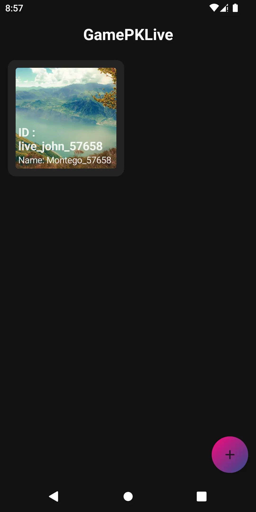

# Game Example Using Moden Architecture

- [x] Kotlin
- [x] Compose
- [x] ViewModel
- [x] DarkMode
- [x] WindowInsets
- [x] Animation

This branch contains UI&Logic implementation

Using Agora RTM to store the Room data.
Using Zego RTC to implemente LIVE scene.

More you can check [HERE](https://www.jianshu.com/p/ac7ee488df86)

## Run

> Since it's a KMM project, Cocoapods is needed.

Go to [AppConfig](./shared/src/commonMain/kotlin/io/agora/live/livegame/AppConfig.kt)
Fill all the `APP_ID` and `APP_TOKEN`.

## ScreenShot

 

